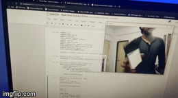

# Real-time-sudoku-solver

The application is a sudoku solver in real time which recognises the digits in the unsolved sudoku image from the webcam using computer vision and solves the sudoku. Following is the small demo of the working project:

# Approach

1) Training the digit recognition model with the datset provided

2) Recognition of digits from the image from webcam

3) Using backtracking algorithm to solve the sudoku

4) Displaying the result with solved sudoku
